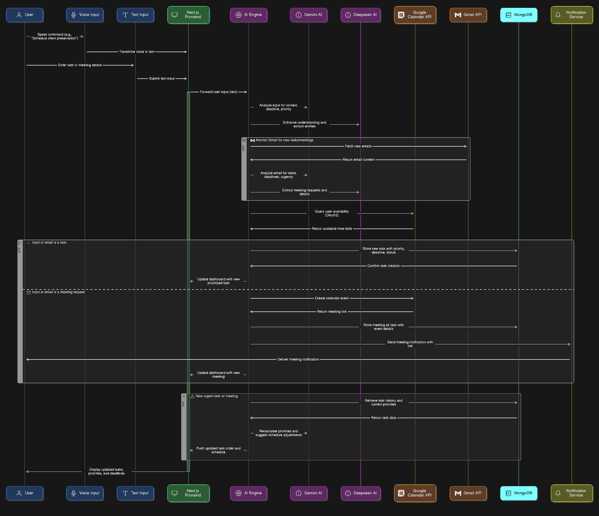

# Smart Auto-Prioritizer: Rethinking Modern Task Management

## Problem Statement

As a busy professional, I've constantly struggled with the inefficiencies of classic task management tools. The endless lists, manual updates, and disconnected calendars make it far too easy to lose track of urgent tasks or miss important deadlines. These static systems simply don't adapt to the dynamic, fast-changing nature of our workdays. I realized what I (and so many others) needed was something more intelligent—something that didn’t just record what I typed, but actually understood what I meant and helped me act on it, instantly.

## My Solution: How Smart Auto-Prioritizer Works

My Smart Auto-Prioritizer is a sophisticated AI-powered task management system designed to revolutionize how I (and users like me) handle daily priorities. The workflow is simple yet powerful. Whether I enter a task by typing or just use my voice (which is seamlessly converted to text), the application springs into action immediately.

The core magic lies in the integration of Gemini AI and Deepseek AI. When I say something like, "I need to prepare the client presentation by next Thursday, it's urgent," the AI doesn’t just transcribe my words—it analyzes the context, extracts the deadline, and senses the implied urgency. It then checks my Google Calendar (via OAuth2 authentication implemented in the backend) to scan for available time slots, automatically suggesting the optimal schedule for me.

But it doesn’t stop there. My system also connects to Gmail using the Gmail API integration I've set up. This means the AI is constantly monitoring my inbox for new tasks or meeting requests. When a new email arrives, it’s analyzed in real-time: the AI classifies its urgency (High, Medium, or Low), extracts any deadlines, and creates a prioritized task for me—no manual entry required. If the email contains a meeting invite, it automatically creates a calendar event (with the Google Calendar API) and notifies me with the meeting link.

All of this data is securely stored in my MongoDB database, which maintains a transparent history of every task, including updates and current status (todo, in-progress, or completed). Even better, the system actually learns from my habits and historical work patterns, using this data to continually refine and improve its prioritization logic.

What ties it all together is the Next.js frontend. Here, I get a beautiful, intuitive dashboard where everything is automatically organized: tasks are sorted into priority buckets, deadlines and urgency are visually highlighted, and my daily schedule adapts as circumstances change. If a new urgent task appears, the system dynamically reshuffles my priorities and adjusts my calendar to ensure nothing slips through the cracks.

## Technology Stack: My Confident Choices

I’ve deliberately chosen a stack that’s both modern and robust. Next.js powers the frontend, delivering a blazing-fast, reactive interface that feels as smooth as any native app. MongoDB is my data store of choice, providing flexible, scalable, and reliable storage for all user and task data. The heart of the intelligence is Gemini AI/Deepseek AI, which handles natural language understanding and prioritization, while Node.js/Express acts as the glue, orchestrating secure API calls between all components. For real-world integration, I’ve implemented OAuth2 for Google Calendar, and set up Gmail API hooks for seamless email-to-task conversion. Deployment on Netlify ensures my system scales effortlessly and remains accessible for users everywhere.

## System Architecture

Below is a visual representation of my system architecture, showing how each component interacts to deliver a seamless, automated, and intelligent task management experience:

## Impact and Scalability

The impact here isn’t just about saving time, though early results show hours reclaimed every week. It’s about reducing cognitive load—removing the mental overhead of juggling priorities and letting the system do the heavy lifting. My approach is inherently scalable: a cloud-native architecture, modular integration points for additional APIs or AI models, and a database that grows as user needs expand. Whether for an individual, a team, or a whole organization, Smart Auto-Prioritizer adapts and evolves.

## Why I Believe in This

This isn’t just another to-do app. It’s a fundamentally new way to approach work—one that’s proactive, adaptive, and personalized to each user. I’m confident in my tech stack and architectural choices: Next.js, MongoDB, Gemini/Deepseek AI, and seamless calendar/email APIs. I’ve seen firsthand how this system can turn chaos into clarity, and I believe it’s precisely what modern professionals need to thrive.
